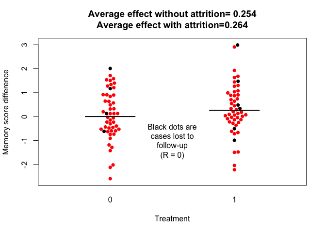

Gentle introduction to DeclareDesign
================
DVM Bishop
20th September 2018

For getting set up to use DeclareDesign, see [this
website](https://declaredesign.org/r/declaredesign/).

We’ll be looking at a simplified version of the code that you can find
[here](https://declaredesign.org/library/articles/pretest_posttest.html).
For the sake of clarity, I’ve modified the script in parts.

The script analyses the effectiveness of an experimental design that is
used to assess an intervention effect by comparing the pre- vs post-test
difference score for treated vs untreated cases. For instance, you could
think of this as testing the effectiveness of brain training on a memory
test. We take a sample of people and measure their memory at time 1.
Half of them are then given the brain-training and the others have a
control intervention. Memory is measured again at time 2. If the
training is effective, we expect the improvement in memory from time 1
to time 2 to be higher for the trained than for the untrained people.

Note that using change scores is not the optimal way to analyse
intervention data, but it provides a simple example of how the package
works. Later on we shall see how DeclareDesign makes it easy to compare
different approaches to analysing trial data, in terms of their
efficiency and power.

The user is asked to estimate certain features of the results of the
study, so that data can be simulated with those characteristics. This
can then be used to evaluate how effective the design is in testing the
hypothesis of interest - in this case the treatment effect.

Before we go further, you should include the R packages you need. If you
have not already installed these, you will need to do that first. Go to
Tools|Install Packages on the menu bar and type the names of the three
packages that have ‘library’ commands below. Then run the lines with
those commands.

``` r
library(DeclareDesign)
library(tidyverse)
library(DesignLibrary)
library(beeswarm)
library(knitr)
```

DeclareDesign differentiates four aspects of experimental design that
are not always distinguished. The first of these is the Model of the
world (M). In our example, the Model for the study requires us to
specify a sample size (N), and pre- and post-test scores for those who
do and don’t have the intervention.

It makes life simpler if we think of the test scores as normal random
deviates - i.e., \(z\)-scores - where the initial pre-test values have
mean of zero and SD of one.

Regardless of intervention, we expect people’s scores to correlate
between time 1 and time 2: i.e., there will some stability in rank
ordering of people’s memory skills across the two measurement occasions.
You have to provide an estimate of this relationship as a correlation
coefficient.

In addition, an intervention effect will be expected just for the
treated group: you have to provide an estimate of this in standard
deviation units - i.e. as Cohen’s \(d\). In the script this is referred
to as the average treatment effect (`ate`).

In intervention studies, it is very rare for all the participants to
remain in the study up to follow-up. A final parameter to be estimated
is the attrition rate - i.e. the proportion of cases that will be lost
to follow-up.

Let’s start by specifying these sample characteristics for our Model.

``` r
N <- 100 # sample size
ate <- 0.25 # average treatment effect
sd_1 <- 1 # SD for group 1
sd_2 <- 1 # SD for group 2
rho <- 0.5 # correlation between time1 and time2
attrition_rate <- .1 # no outcome data for N*attrition_rate subjects
```

In the next chunk of code, we input these parameters into our model.
When we do this using the `declare_population()` function, we create a
data frame which contains simulated data. Usually, when we run scripts
from DeclareDesign, we would not see the data frame that is gradually
built up as the script proceeds, but to improve understanding of the
functions, we will inspect the simulated data for each chunk, looking
just at the first few rows that are created.

``` r
# M: Model
population <- declare_population(
  N    = N,
  u_t1 = rnorm(N)*sd_1,
  u_t2 = rnorm(N, rho * u_t1, sqrt(1 - rho^2))*sd_2
)

df1 <- population()
kable(head(df1))
```

| ID  |       u\_t1 |       u\_t2 |
| :-- | ----------: | ----------: |
| 001 |   1.5090495 | \-1.0821030 |
| 002 | \-1.3919084 | \-0.9980893 |
| 003 | \-0.3278589 | \-0.0295368 |
| 004 |   0.0136273 | \-0.5112684 |
| 005 |   0.8659487 |   0.9933361 |
| 006 |   0.6058704 |   1.8013116 |

You will see that we have a data frame with four columns. There are 100
rows (or as many as you have specified in `N`), but we just display the
first six. The first column is just a subject identifier. We then have
the two columns `u_t1` and `u_t2`. You can think of these as the
underlying variables from which the observed test scores will be
derived.

We specified that there should be a correlation of `rho` between `u_t1`
and `u_t2`. Let’s see what this looks like:

``` r
mytitle <- paste0('r = ', round(cor(df1$u_t1, df1$u_t2), 3))
plot(df1$u_t1, df1$u_t2, main = mytitle, col = 2, pch = 16)
```

<!-- -->

It is unlikely that the correlation will be exactly the one you
specified. That is because we are taking a sample from a population. You
can think of the population as an enormous number of paired observations
of `u_t1` and `u_t2` from which we are just selecting a subset of pairs.
The larger our sample, the closer the observed correlation will be to
the value of `rho` that was specified. Unless you set the random number
generator to give the same answer every time (see [set.seed
command](http://rfunction.com/archives/62)), the specific values of
`u_t1` and `u_t2` will change every time you run the script.

Next, we need to define the potential outcomes of the study – i.e., the
outcome that unit 1 exhibits when assigned to the treatment versus when
they are assigned to the control. We first define the treatment and
control potential outcomes at the pre-test phase, \(Y_t1\). In the chunk
below, you’ll notice that our pretest score potential outcomes,
`Y_t1_Z_0` and `Y_t1_Z_1`, are identical to `u_t1`. Although this may
seem redundant, there are two good reasons to specify the outcomes in
that way. First, specifying the pre-treatment outcomes as identical in
the pre-test period makes explicit our assumption that the treatment
only affects outcomes in the second period. Thus, we’ve explicitly ruled
out anticipation effects.

Second, in general it is helpful to keep separate the original
underlying variables that are generated and the observed variables that
we will enter into the analysis. This provides the flexibility to have
observed variables that are not normally distributed. We could, for
example, generate `Y_t1` as a binary variable through a probit
transformation of `u_t1` by changing the declaration of `Y_t1` in our
population to `draw_binary(N = N,latent = u_t1,link = "probit")`.\[1\]

`Y_t2` is not a simple function of `u_t2`, because it depends on the
intervention. For those who have the intervention, we need to add the
average treatment effect, `ate`, to `u_t2` whenever the treatment
condition, `Z`, is specified as `1`. We have not yet specified which
individuals have treatment, but we create two new columns giving
potential outcomes that tell us what *would* happen if a case were
treated or untreated.

Again, we will inspect the first few rows, and see the new columns
created by the data frame. We’ll also plot the values for the potential
outcomes to observe the treatment effect. Note that the points for the
treated condition are simply increased by an amount equivalent to `ate`.
When we come to the data strategy step below, we will allocate cases as
treated or not treated, but at the model stage, we are just representing
potential outcomes.

``` r
potential_outcomes <- declare_potential_outcomes(
  Y_t1_Z_0 = u_t1,
  Y_t1_Z_1 = u_t1,
  Y_t2_Z_0 = u_t2,
  Y_t2_Z_1 = u_t2 + ate)

df1 <- potential_outcomes(df1)
kable(head(df1))
```

| ID  |       u\_t1 |       u\_t2 | Y\_t1\_Z\_0 | Y\_t1\_Z\_1 | Y\_t2\_Z\_0 | Y\_t2\_Z\_1 |
| :-- | ----------: | ----------: | ----------: | ----------: | ----------: | ----------: |
| 001 |   1.5090495 | \-1.0821030 |   1.5090495 |   1.5090495 | \-1.0821030 | \-0.8321030 |
| 002 | \-1.3919084 | \-0.9980893 | \-1.3919084 | \-1.3919084 | \-0.9980893 | \-0.7480893 |
| 003 | \-0.3278589 | \-0.0295368 | \-0.3278589 | \-0.3278589 | \-0.0295368 |   0.2204632 |
| 004 |   0.0136273 | \-0.5112684 |   0.0136273 |   0.0136273 | \-0.5112684 | \-0.2612684 |
| 005 |   0.8659487 |   0.9933361 |   0.8659487 |   0.8659487 |   0.9933361 |   1.2433361 |
| 006 |   0.6058704 |   1.8013116 |   0.6058704 |   0.6058704 |   1.8013116 |   2.0513116 |

We now move to the Inquiry part of the model. Here we just have to
specify the true underlying quantity we want to estimate. In this case,
we specify two. The first is the average treatment effect in the
post-test period (`ATE`), defined as the true mean post-test difference
between the treatment and control potential outcomes of the dependent
variable, `Y`. We also define the true underlying
difference-in-differences (`DiD`) as an estimand, i.e., the true average
difference in pre-post differences between treatment and control. In
fact, because potential outcomes are identical in the pre-test period,
these estimands are equivalent to one another. If we incorporated a
violation of the no-anticipation effects assumption, for example, the
estimands would no longer be equivalent. Specifying our inquiry thus
helps clarify the assumptions on which our inferences are based.

``` r
# I: Inquiry
estimand <- declare_estimand(ATE = mean(Y_t2_Z_1 - Y_t2_Z_0),
                             DiD = mean((Y_t2_Z_1 - Y_t1_Z_1) - (Y_t2_Z_0 - Y_t1_Z_0)))
kable(estimand(df1))
```

| estimand\_label | estimand |
| :-------------- | -------: |
| ATE             |     0.25 |
| DiD             |     0.25 |

The next step is termed the Data Strategy. At this step we determine how
individuals are assigned to groups, and we also take into account any
sample attrition. In effect, we determine which cases will feature in
which groups in the analysis.

By looking at how `df1` changes at each step of the script, we can see
what is being achieved.

First we declare how cases are assigned to treatments (`Z`). The
variable `Z_cond_prob` is the conditional probability that a given case
is in the treatment group, given it was assigned to treatment (and vice
versa for control).\[2\] The default is for 50% to be assigned to each
of two groups. In effect, the script acts to toss a coin that determines
assignment of each case to `Z = 1` or `Z = 0`.

``` r
# D: Data Strategy
assignment <- declare_assignment(prob = .5)

df1 <- assignment(df1)
kable(head(df1))
```

| ID  |       u\_t1 |       u\_t2 | Y\_t1\_Z\_0 | Y\_t1\_Z\_1 | Y\_t2\_Z\_0 | Y\_t2\_Z\_1 | Z | Z\_cond\_prob |
| :-- | ----------: | ----------: | ----------: | ----------: | ----------: | ----------: | -: | ------------: |
| 001 |   1.5090495 | \-1.0821030 |   1.5090495 |   1.5090495 | \-1.0821030 | \-0.8321030 | 0 |           0.5 |
| 002 | \-1.3919084 | \-0.9980893 | \-1.3919084 | \-1.3919084 | \-0.9980893 | \-0.7480893 | 1 |           0.5 |
| 003 | \-0.3278589 | \-0.0295368 | \-0.3278589 | \-0.3278589 | \-0.0295368 |   0.2204632 | 1 |           0.5 |
| 004 |   0.0136273 | \-0.5112684 |   0.0136273 |   0.0136273 | \-0.5112684 | \-0.2612684 | 0 |           0.5 |
| 005 |   0.8659487 |   0.9933361 |   0.8659487 |   0.8659487 |   0.9933361 |   1.2433361 | 0 |           0.5 |
| 006 |   0.6058704 |   1.8013116 |   0.6058704 |   0.6058704 |   1.8013116 |   2.0513116 | 1 |           0.5 |

Next we take into account the attrition rate. New columns are added to
the simulation: `R` specifies whether or not the case is lost to
follow-up, according to the attrition rate we specified. Since attrition
is set to only 10%, you probably will only see cases where `R = 1` in
the brief part of the data frame that is shown below, but 10% of cases
will have `R` set to zero. (If you wish you can inspect all values by
typing `df1$R` at the console).

``` r
report <- declare_assignment(prob = (1 - attrition_rate),
                             assignment_variable = R)

df1 <- report(df1)
kable(head(df1))
```

| ID  |       u\_t1 |       u\_t2 | Y\_t1\_Z\_0 | Y\_t1\_Z\_1 | Y\_t2\_Z\_0 | Y\_t2\_Z\_1 | Z | Z\_cond\_prob | R | R\_cond\_prob |
| :-- | ----------: | ----------: | ----------: | ----------: | ----------: | ----------: | -: | ------------: | -: | ------------: |
| 001 |   1.5090495 | \-1.0821030 |   1.5090495 |   1.5090495 | \-1.0821030 | \-0.8321030 | 0 |           0.5 | 1 |           0.9 |
| 002 | \-1.3919084 | \-0.9980893 | \-1.3919084 | \-1.3919084 | \-0.9980893 | \-0.7480893 | 1 |           0.5 | 1 |           0.9 |
| 003 | \-0.3278589 | \-0.0295368 | \-0.3278589 | \-0.3278589 | \-0.0295368 |   0.2204632 | 1 |           0.5 | 1 |           0.9 |
| 004 |   0.0136273 | \-0.5112684 |   0.0136273 |   0.0136273 | \-0.5112684 | \-0.2612684 | 0 |           0.5 | 1 |           0.9 |
| 005 |   0.8659487 |   0.9933361 |   0.8659487 |   0.8659487 |   0.9933361 |   1.2433361 | 0 |           0.5 | 0 |           0.1 |
| 006 |   0.6058704 |   1.8013116 |   0.6058704 |   0.6058704 |   1.8013116 |   2.0513116 | 1 |           0.5 | 1 |           0.9 |

Next we need to create the actual values of `Y_t1` and `Y_t2` that apply
with this assignment - for cases where `Z` is 0 we use the values of
`Y_t1_Z_0` and `Y_t2_Z_0`, and for cases where `Z` is 1 we use the value
of `Y_t1_Z_1` and `Y_t2_Z_1`. The declare\_reveal function automatically
reveals the potential outcomes corresponding to a given assignment of
treatment.

``` r
reveal_t1 <- declare_reveal(Y_t1) 
reveal_t2 <- declare_reveal(Y_t2) 

df1 <- reveal_t1(df1)
df1 <- reveal_t2(df1)

kable(head(df1))
```

| ID  |       u\_t1 |       u\_t2 | Y\_t1\_Z\_0 | Y\_t1\_Z\_1 | Y\_t2\_Z\_0 | Y\_t2\_Z\_1 | Z | Z\_cond\_prob | R | R\_cond\_prob |       Y\_t1 |       Y\_t2 |
| :-- | ----------: | ----------: | ----------: | ----------: | ----------: | ----------: | -: | ------------: | -: | ------------: | ----------: | ----------: |
| 001 |   1.5090495 | \-1.0821030 |   1.5090495 |   1.5090495 | \-1.0821030 | \-0.8321030 | 0 |           0.5 | 1 |           0.9 |   1.5090495 | \-1.0821030 |
| 002 | \-1.3919084 | \-0.9980893 | \-1.3919084 | \-1.3919084 | \-0.9980893 | \-0.7480893 | 1 |           0.5 | 1 |           0.9 | \-1.3919084 | \-0.7480893 |
| 003 | \-0.3278589 | \-0.0295368 | \-0.3278589 | \-0.3278589 | \-0.0295368 |   0.2204632 | 1 |           0.5 | 1 |           0.9 | \-0.3278589 |   0.2204632 |
| 004 |   0.0136273 | \-0.5112684 |   0.0136273 |   0.0136273 | \-0.5112684 | \-0.2612684 | 0 |           0.5 | 1 |           0.9 |   0.0136273 | \-0.5112684 |
| 005 |   0.8659487 |   0.9933361 |   0.8659487 |   0.8659487 |   0.9933361 |   1.2433361 | 0 |           0.5 | 0 |           0.1 |   0.8659487 |   0.9933361 |
| 006 |   0.6058704 |   1.8013116 |   0.6058704 |   0.6058704 |   1.8013116 |   2.0513116 | 1 |           0.5 | 1 |           0.9 |   0.6058704 |   2.0513116 |

Now we compute the difference score for each individual, which is the
statistic we are using in our analysis. This is computed as the
difference between `Y` at time 1 and `Y` at time 2. The beeswarm plot
below shows the scores for all cases in the two groups. Our specified
attrition rate will determine the proportion of cases lost to follow-up,
shown in the plot as black dots. The mean effect size of treatment is
shown both for the complete sample and the available sample after
excluding those lost to attrition. Note this is unlikely to be exactly
equal to the average treatment effect (`ate`), because the estimate is
based on a sample, whereas `ate` is defined in terms of the
population.

``` r
manipulation <- declare_step(difference = (Y_t2 - Y_t1), handler = fabricate)  
df1 <- manipulation(df1)

kable(head(df1))
```

| ID  |       u\_t1 |       u\_t2 | Y\_t1\_Z\_0 | Y\_t1\_Z\_1 | Y\_t2\_Z\_0 | Y\_t2\_Z\_1 | Z | Z\_cond\_prob | R | R\_cond\_prob |       Y\_t1 |       Y\_t2 |  difference |
| :-- | ----------: | ----------: | ----------: | ----------: | ----------: | ----------: | -: | ------------: | -: | ------------: | ----------: | ----------: | ----------: |
| 001 |   1.5090495 | \-1.0821030 |   1.5090495 |   1.5090495 | \-1.0821030 | \-0.8321030 | 0 |           0.5 | 1 |           0.9 |   1.5090495 | \-1.0821030 | \-2.5911524 |
| 002 | \-1.3919084 | \-0.9980893 | \-1.3919084 | \-1.3919084 | \-0.9980893 | \-0.7480893 | 1 |           0.5 | 1 |           0.9 | \-1.3919084 | \-0.7480893 |   0.6438191 |
| 003 | \-0.3278589 | \-0.0295368 | \-0.3278589 | \-0.3278589 | \-0.0295368 |   0.2204632 | 1 |           0.5 | 1 |           0.9 | \-0.3278589 |   0.2204632 |   0.5483221 |
| 004 |   0.0136273 | \-0.5112684 |   0.0136273 |   0.0136273 | \-0.5112684 | \-0.2612684 | 0 |           0.5 | 1 |           0.9 |   0.0136273 | \-0.5112684 | \-0.5248956 |
| 005 |   0.8659487 |   0.9933361 |   0.8659487 |   0.8659487 |   0.9933361 |   1.2433361 | 0 |           0.5 | 0 |           0.1 |   0.8659487 |   0.9933361 |   0.1273874 |
| 006 |   0.6058704 |   1.8013116 |   0.6058704 |   0.6058704 |   1.8013116 |   2.0513116 | 1 |           0.5 | 1 |           0.9 |   0.6058704 |   2.0513116 |   1.4454411 |

``` r
mydiff <- round(mean(df1$difference[df1$Z==1])-mean(df1$difference[df1$Z==0]),3)
mytemp <- filter(df1, R==1)
mean1 <- mean(mytemp$difference[mytemp$Z==1])
mean0 <- mean(mytemp$difference[mytemp$Z==0])
mydiff2 <- round((mean1-mean0),3)
mytitle <- paste0('Average effect without attrition= ', mydiff,'\nAverage effect with attrition=',mydiff2)
beeswarm(df1$difference~df1$Z,xlab='Treatment',pwcol=(df1$R+1),pch=16,main=mytitle,ylab='Memory score difference')

segments(.8, mean0, x1=1.2,y1 = mean0,lty=1,col=1,lwd=2) #add line for mean
segments(1.8, mean1, x1=2.2,y1 = mean1,lty=1,col=1,lwd=2)
text(1.5,-1,'Black dots are\n cases lost to \nfollow-up\n(R = 0)')
```

<!-- -->

The final stage is the Answer strategy. This specifies the statistical
procedure used to evaluate the inquiry, using the data simulated from
the model. In the chunk below, we can see the output from the Answer
strategy. You can if you wish view the computed variable `mylm`, which
shows that the output from `estimated_effect(df1)` is identical to the
result obtained by running the code for the robust regression analysis
on `df1`, after excluding those with values of `R = 0` (i.e., the cases
lost to follow-up).

``` r
# A: Answer Strategy
# Use difference score between pretest and posttest
estimated_effect <- declare_estimator(
  difference ~ Z,
  model = lm_robust,
  estimand = c("ATE","DiD"),
  subset = R == 1,
  label = "Change score"
)


kable(estimated_effect(df1)) # print the results of the regression
```

| estimator\_label | term |  estimate | std.error | statistic |   p.value |    conf.low | conf.high | df | outcome    | estimand\_label |
| :--------------- | :--- | --------: | --------: | --------: | --------: | ----------: | --------: | -: | :--------- | :-------------- |
| Change score     | Z    | 0.2638231 | 0.2127617 |  1.239993 | 0.2182741 | \-0.1589961 | 0.6866423 | 88 | difference | ATE             |
| Change score     | Z    | 0.2638231 | 0.2127617 |  1.239993 | 0.2182741 | \-0.1589961 | 0.6866423 | 88 | difference | DiD             |

``` r
mylm <- lm_robust(formula = difference ~ Z, data = subset(df1,R == 1))
```

## Evaluating the design

We’ve worked through the analysis building up simulated data for one
run, but the principal purpose of this exercise is to evaluate the
design by repeatedly running the simulation so that the distribution of
statistics can be obtained.

To do this, you specify the design by creating a list of all the
processes that were involved above, joined by `+`.

The `diagnose_design()` function then computes various diagnostic
statistics for that design. The default number of simulations is 500.
This chunk of code takes time to run, with the amount of time dependent
on the number of simulations.

We can then see the diagnostic statistics for the design. In this script
we’ve assigned the diagnostic information to a variable, `diagnosis1`,
so we can display it differently, but usually you’d just have this
displayed automatically on the console, using the command
`diagnose_design(pretest_posttest_design)`.

``` r
# Design
pretest_posttest_design <- population + potential_outcomes + estimand +
  assignment + reveal_t1 + reveal_t2 + report + manipulation +
  estimated_effect 

diagnosis1 <- diagnose_design(pretest_posttest_design)
kable(reshape_diagnosis(diagnosis1))
```

| Design Label              | Estimand Label | Estimator Label | Term | N Sims | Bias   | RMSE   | Power  | Coverage | Mean Estimate | SD Estimate | Mean Se | Type S Rate | Mean Estimand |
| :------------------------ | :------------- | :-------------- | :--- | :----- | :----- | :----- | :----- | :------- | :------------ | :---------- | :------ | :---------- | :------------ |
| pretest\_posttest\_design | ATE            | Change score    | Z    | 500    | \-0.00 | 0.21   | 0.22   | 0.95     | 0.25          | 0.21        | 0.21    | 0.01        | 0.25          |
|                           |                |                 |      |        | (0.01) | (0.01) | (0.02) | (0.01)   | (0.01)        | (0.01)      | (0.00)  | (0.01)      | (0.00)        |
| pretest\_posttest\_design | DiD            | Change score    | Z    | 500    | \-0.00 | 0.21   | 0.22   | 0.95     | 0.25          | 0.21        | 0.21    | 0.01        | 0.25          |
|                           |                |                 |      |        | (0.01) | (0.01) | (0.02) | (0.01)   | (0.01)        | (0.01)      | (0.00)  | (0.01)      | (0.00)        |

With the design in hand, we can also use it to quickly generate data,
estimates, and estimands. You can try running the code below multiple
times. You’ll get different answers because the experiment is being
simulated from start to finish each
time.

``` r
kable(head(draw_data(pretest_posttest_design)))
```

| ID  |       u\_t1 |       u\_t2 | Y\_t1\_Z\_0 | Y\_t1\_Z\_1 | Y\_t2\_Z\_0 | Y\_t2\_Z\_1 | Z | Z\_cond\_prob |       Y\_t1 |       Y\_t2 | R | R\_cond\_prob |  difference |
| :-- | ----------: | ----------: | ----------: | ----------: | ----------: | ----------: | -: | ------------: | ----------: | ----------: | -: | ------------: | ----------: |
| 001 |   0.2930994 | \-1.1249877 |   0.2930994 |   0.2930994 | \-1.1249877 | \-0.8749877 | 1 |           0.5 |   0.2930994 | \-0.8749877 | 1 |           0.9 | \-1.1680871 |
| 002 |   0.1850891 |   0.0113886 |   0.1850891 |   0.1850891 |   0.0113886 |   0.2613886 | 0 |           0.5 |   0.1850891 |   0.0113886 | 0 |           0.1 | \-0.1737006 |
| 003 |   1.6205123 |   0.4069054 |   1.6205123 |   1.6205123 |   0.4069054 |   0.6569054 | 1 |           0.5 |   1.6205123 |   0.6569054 | 1 |           0.9 | \-0.9636069 |
| 004 | \-0.2239245 | \-1.0333108 | \-0.2239245 | \-0.2239245 | \-1.0333108 | \-0.7833108 | 0 |           0.5 | \-0.2239245 | \-1.0333108 | 1 |           0.9 | \-0.8093863 |
| 005 |   0.5245367 |   0.7901034 |   0.5245367 |   0.5245367 |   0.7901034 |   1.0401034 | 1 |           0.5 |   0.5245367 |   1.0401034 | 1 |           0.9 |   0.5155667 |
| 006 |   0.9885345 |   1.6868694 |   0.9885345 |   0.9885345 |   1.6868694 |   1.9368694 | 1 |           0.5 |   0.9885345 |   1.9368694 | 1 |           0.9 |   0.9483349 |

``` r
kable(head(get_estimates(pretest_posttest_design)))
```

| estimator\_label | term |    estimate | std.error |   statistic |   p.value |    conf.low | conf.high | df | outcome    | estimand\_label |
| :--------------- | :--- | ----------: | --------: | ----------: | --------: | ----------: | --------: | -: | :--------- | :-------------- |
| Change score     | Z    | \-0.1424176 | 0.2020952 | \-0.7047058 | 0.4828543 | \-0.5440393 |  0.259204 | 88 | difference | ATE             |
| Change score     | Z    | \-0.1424176 | 0.2020952 | \-0.7047058 | 0.4828543 | \-0.5440393 |  0.259204 | 88 | difference | DiD             |

``` r
kable(head(get_estimands(pretest_posttest_design)))
```

| estimand\_label | estimand |
| :-------------- | -------: |
| ATE             |     0.25 |
| DiD             |     0.25 |

## Interpreting diagnostic information

To understand the output, it helps to read the [working
paper](https://declaredesign.org/declare.pdf).

I’ve transposed the output and added some explanation in the chunk
below.

``` r
myoutput<-data.frame(t(diagnosis1$diagnosands_df[1,]))
#Add a column for explanation
myoutput$explanation<-'.'
colnames(myoutput)[1]<-'Estimate'
myoutput$explanation[5]<-'Expected difference between estimate and estimand'
myoutput$explanation[7]<-'Root mean squared error'
myoutput$explanation[9]<-'Probability of rejecting null hypothesis of no effect'
myoutput$explanation[11]<-'Probability that estimand falls within conf. interval'
myoutput$explanation[19]<-'Probability that a significant estimate has incorrect sign'
kable(myoutput)
```

|                    | Estimate                  | explanation                                                |
| ------------------ | :------------------------ | :--------------------------------------------------------- |
| design\_label      | pretest\_posttest\_design | .                                                          |
| estimand\_label    | ATE                       | .                                                          |
| estimator\_label   | Change score              | .                                                          |
| term               | Z                         | .                                                          |
| bias               | \-0.003260086             | Expected difference between estimate and estimand          |
| se(bias)           | 0.008802827               | .                                                          |
| rmse               | 0.2132647                 | Root mean squared error                                    |
| se(rmse)           | 0.006722144               | .                                                          |
| power              | 0.218                     | Probability of rejecting null hypothesis of no effect      |
| se(power)          | 0.01638999                | .                                                          |
| coverage           | 0.948                     | Probability that estimand falls within conf. interval      |
| se(coverage)       | 0.009505256               | .                                                          |
| mean\_estimate     | 0.2467399                 | .                                                          |
| se(mean\_estimate) | 0.008802827               | .                                                          |
| sd\_estimate       | 0.2134533                 | .                                                          |
| se(sd\_estimate)   | 0.00669351                | .                                                          |
| mean\_se           | 0.2090395                 | .                                                          |
| se(mean\_se)       | 0.0007504204              | .                                                          |
| type\_s\_rate      | 0.009174312               | Probability that a significant estimate has incorrect sign |
| se(type\_s\_rate)  | 0.008267894               | .                                                          |
| mean\_estimand     | 0.25                      | .                                                          |
| se(mean\_estimand) | 0                         | .                                                          |
| n\_sims            | 500                       | .                                                          |

## Design library

The goal of this explanation is to give you some understanding of the
processes involved in DeclareDesign; this will make it easier for you to
modify scripts for specific purposes. In practice, however, for the main
types of common design, you can run the same processes with minimal
scripting by using the functions in the DesignLibrary package, which
simplifies the process of using DeclareDesign.

In effect, you just have to specify the key parameters, and the rest is
done for you by the `pretest_posttest_designer()` function. For example,
if you wanted to see what would happen to power if the attrition rate
increased to 20%, you could look at
`diagnose_design(pretest_posttest_designer(attrition_rate = .20))`. Or
you could compare power under three different assumptions about how well
your baseline predicts the endline using
`diagnose_design(expand_design(pretest_posttest_designer,rho =
c(.2,.5,.8)))`.

Note that with the `pretest_posttest_designer()` function, you get
diagnoses for three possible ways of running the analysis. The first is
‘Change score’, which is the same as we have used above - you compare
the pretest-posttest difference for the two treatment conditions. An
alternative approach is to compare the groups on the posttest score,
treating the pretest score as a covariate: this is labelled ‘Condition
on pretest’. The final approach is to just use posttest scores, ignoring
pretest data: this is ‘Posttest only’.

The Design Library is very helpful for understanding strengths and
weaknesses of different
approaches.

``` r
mydes <- pretest_posttest_designer(N = 100, ate = 0.25, sd_1 = 1, sd_2 = 1,
                                   rho = 0.5, attrition_rate = 0.1)
mydeslib <- diagnose_design(mydes)

kable(data.frame(t(mydeslib$diagnosands_df)))
```

|                    | X1            | X2                   | X3            |
| ------------------ | :------------ | :------------------- | :------------ |
| design\_label      | mydes         | mydes                | mydes         |
| estimand\_label    | ATE           | ATE                  | ATE           |
| estimator\_label   | Change score  | Condition on pretest | Posttest only |
| term               | Z             | Z                    | Z             |
| bias               | \-0.019871506 | \-0.013395370        | \-0.009998607 |
| se(bias)           | 0.008970996   | 0.007499984          | 0.008244489   |
| rmse               | 0.2123799     | 0.1820344            | 0.1990697     |
| se(rmse)           | 0.007181608   | 0.005999821          | 0.005948356   |
| power              | 0.182         | 0.248                | 0.226         |
| se(power)          | 0.01570767    | 0.01952994           | 0.01782042    |
| coverage           | 0.934         | 0.948                | 0.960         |
| se(coverage)       | 0.009705481   | 0.010498600          | 0.009113515   |
| mean\_estimate     | 0.2301285     | 0.2366046            | 0.2400014     |
| se(mean\_estimate) | 0.008970996   | 0.007499984          | 0.008244489   |
| sd\_estimate       | 0.2116599     | 0.1817226            | 0.1990176     |
| se(sd\_estimate)   | 0.007082950   | 0.005946267          | 0.005906017   |
| mean\_se           | 0.2102148     | 0.1826259            | 0.1989494     |
| se(mean\_se)       | 0.0007662894  | 0.0006944536         | 0.0007068511  |
| type\_s\_rate      | 0             | 0                    | 0             |
| se(type\_s\_rate)  | 0             | 0                    | 0             |
| mean\_estimand     | 0.25          | 0.25                 | 0.25          |
| se(mean\_estimand) | 0             | 0                    | 0             |
| n\_sims            | 500           | 500                  | 500           |

# Session information

Session information is included for technical reasons: it can help
diagnose issues if a script does not run in a given environment.

``` r
sessionInfo()
```

    ## R version 3.5.1 (2018-07-02)
    ## Platform: x86_64-apple-darwin15.6.0 (64-bit)
    ## Running under: macOS High Sierra 10.13.5
    ## 
    ## Matrix products: default
    ## BLAS: /Library/Frameworks/R.framework/Versions/3.5/Resources/lib/libRblas.0.dylib
    ## LAPACK: /Library/Frameworks/R.framework/Versions/3.5/Resources/lib/libRlapack.dylib
    ## 
    ## locale:
    ## [1] en_US.UTF-8/en_US.UTF-8/en_US.UTF-8/C/en_US.UTF-8/en_US.UTF-8
    ## 
    ## attached base packages:
    ## [1] stats     graphics  grDevices utils     datasets  methods   base     
    ## 
    ## other attached packages:
    ##  [1] bindrcpp_0.2.2       knitr_1.20           beeswarm_0.2.3      
    ##  [4] DesignLibrary_0.1.1  forcats_0.3.0        stringr_1.3.1       
    ##  [7] dplyr_0.7.6          purrr_0.2.5          readr_1.1.1         
    ## [10] tidyr_0.8.1          tibble_1.4.2         ggplot2_3.0.0       
    ## [13] tidyverse_1.2.1      DeclareDesign_0.11.0 estimatr_0.11.0     
    ## [16] fabricatr_0.5.0      randomizr_0.16.1    
    ## 
    ## loaded via a namespace (and not attached):
    ##  [1] tidyselect_0.2.4   listenv_0.7.0      haven_1.1.2.9000  
    ##  [4] lattice_0.20-35    colorspace_1.3-2   htmltools_0.3.6   
    ##  [7] yaml_2.2.0         rlang_0.2.1        pillar_1.3.0      
    ## [10] glue_1.3.0         withr_2.1.2        modelr_0.1.2      
    ## [13] readxl_1.1.0       bindr_0.1.1        plyr_1.8.4        
    ## [16] munsell_0.5.0      gtable_0.2.0       cellranger_1.1.0  
    ## [19] rvest_0.3.2        future_1.9.0       codetools_0.2-15  
    ## [22] evaluate_0.11      parallel_3.5.1     highr_0.7         
    ## [25] broom_0.5.0        Rcpp_0.12.18       scales_0.5.0      
    ## [28] backports_1.1.2    jsonlite_1.5       hms_0.4.2         
    ## [31] digest_0.6.15      stringi_1.2.4      grid_3.5.1        
    ## [34] rprojroot_1.3-2    cli_1.0.0          tools_3.5.1       
    ## [37] magrittr_1.5       lazyeval_0.2.1     Formula_1.2-3     
    ## [40] future.apply_1.0.0 crayon_1.3.4       pkgconfig_2.0.1   
    ## [43] xml2_1.2.0         lubridate_1.7.4    assertthat_0.2.0  
    ## [46] rmarkdown_1.10     httr_1.3.1         rstudioapi_0.7    
    ## [49] globals_0.12.1     R6_2.2.2           nlme_3.1-137      
    ## [52] compiler_3.5.1

1.  Note that, generally speaking, non-linear transformations of `u_t1`
    and `u_t2` might lead to correlations between `Y_t1` and `Y_t2` that
    are not equal to `rho` in expectation.

2.  For example, if the probability of assignment was .8, then units
    assigned to the control would have `Z_cond_prob = .2` and those
    assigned to treatment would have `Z_cond_prob = .8`. This is useful
    for designs where you want to weight observations by their
    assignment probabilities.
